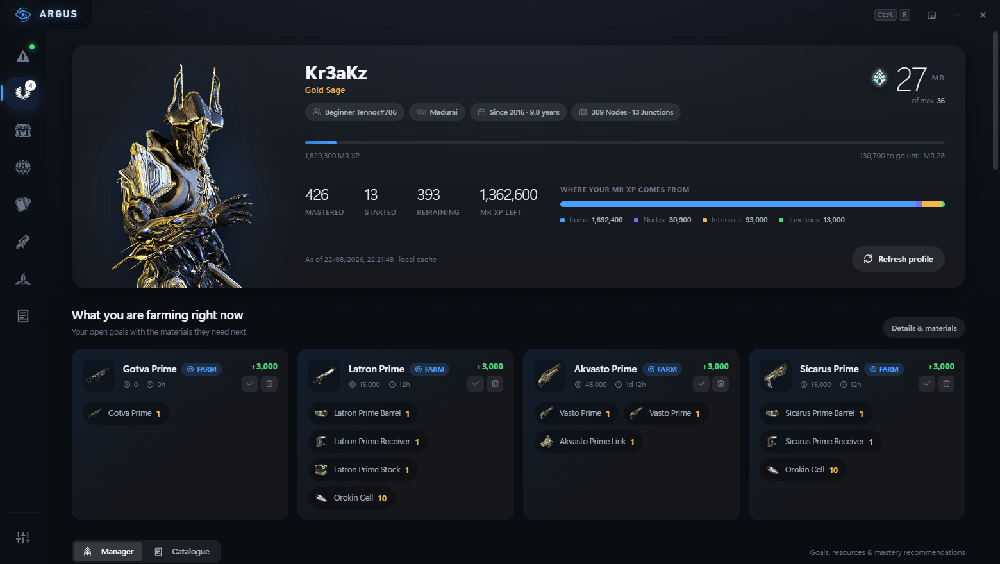
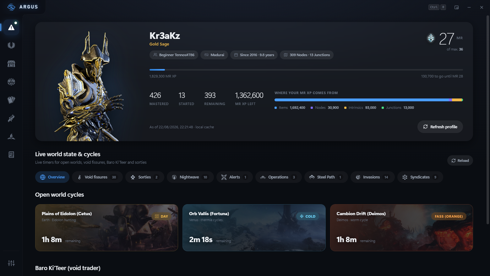
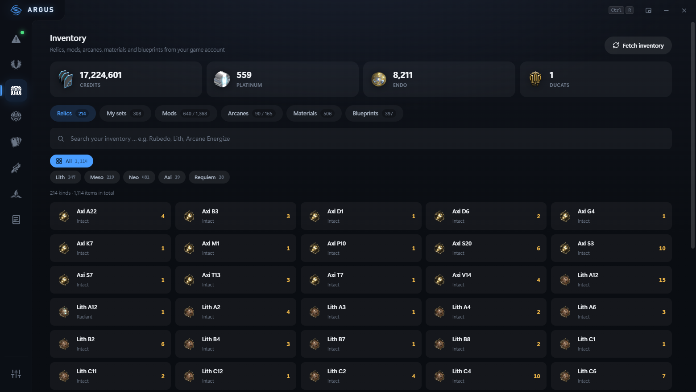
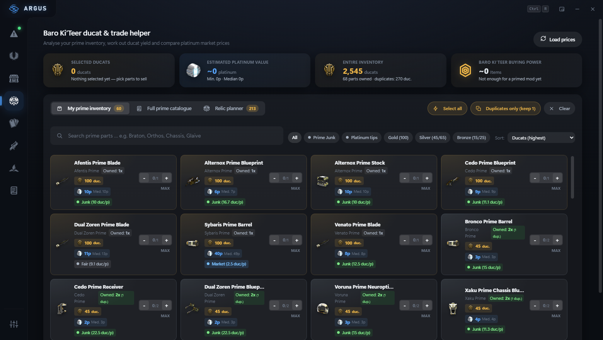
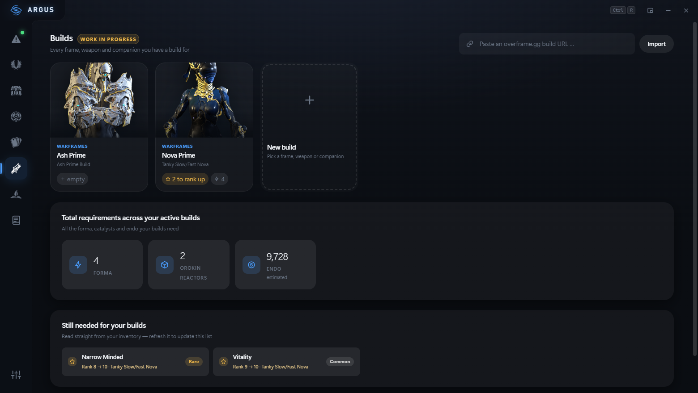
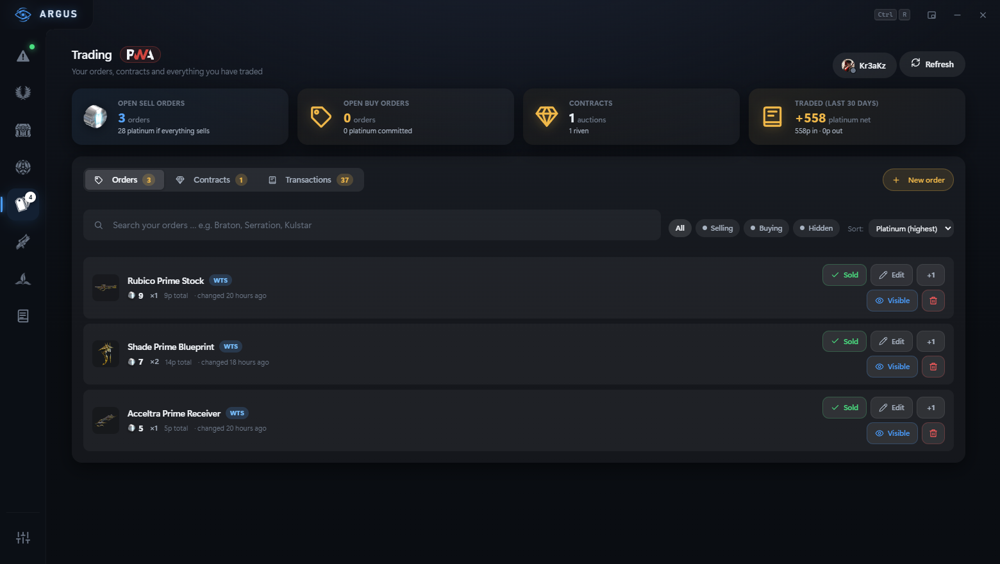
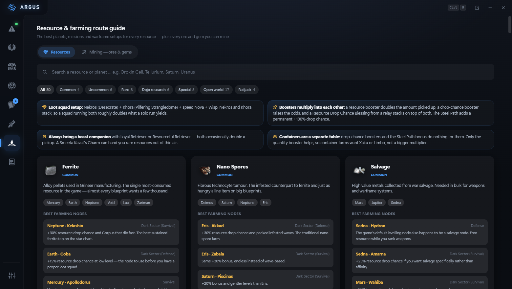
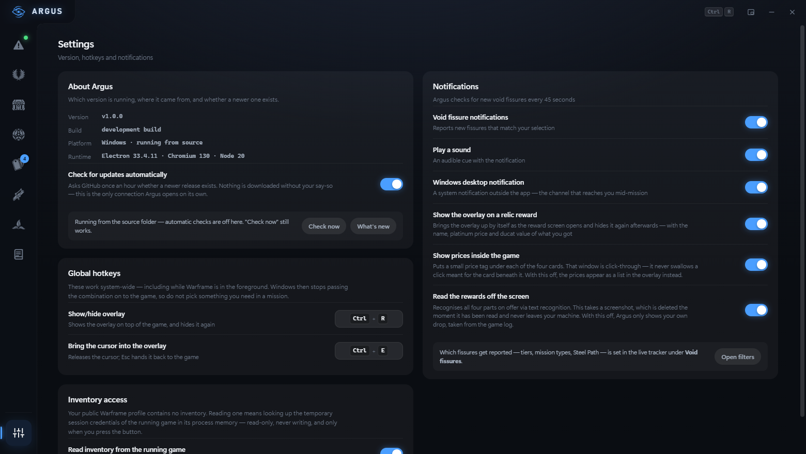

<div align="center">


# Argus

**A mastery rank planner and live companion for Warframe.**

*The hundred-eyed watchman of Greek myth — he never closes all his eyes at once.*

[](https://github.com/Kr3akz/Argus/releases/latest)
[](https://github.com/Kr3akz/Argus/releases)
[](LICENSE)


</div>

---

Argus shows which items you are still missing for mastery rank, what pays off fastest,
and breaks farming goals down to the raw materials. While you play, an overlay keeps the
open-world cycles, void fissures and your goals on screen — and when a relic reward
screen opens, it puts a platinum price and ducat value under all four parts.

**Windows only.** The overlay, the log reader and the inventory lookup all rely on
Windows APIs.



<details>
<summary><b>More screenshots</b></summary>

<br>

**Live world state — cycles, fissures and timers**



**Inventory — mods and arcanes as the cards they are in game**



**Ducats — what to hand Baro, and the relic planner**



**Builds — against what you actually own**



**Trading — orders, contracts and the ledger**



**Farming guide — best nodes per material**



**Settings — version, hotkeys and notifications**



</details>

---

## What it does

| | |
|---|---|
| **Mastery planning** | Every item you have not mastered, ranked by what it actually costs you. Set goals and Argus resolves them down to the raw materials — including how long the build actually takes, and whether the vault is shut on it. |
| **Live world state** | Open-world cycles, void fissures, sorties, Nightwave, invasions, Steel Path and Baro Ki'Teer, with desktop notifications for the fissures you care about. → [overlay & notifications](docs/controls.md) |
| **Weekly rotation** | Everything that resets once a week in one place — Archon Hunt, The Circuit, Deep and Temporal Archimedea, Netracells, Kahl's Garrison, and the vendor resets for Teshin, Bird 3, Yonta, Acrithis, Palladino and Nightwave. |
| **Relic rewards** | The reward screen opens, Argus reads all four parts off the screen and puts the platinum price and ducat value under each card — inside the game. → [details](docs/relics.md) |
| **Inventory** | Your mods, arcanes and relics as the cards they are in game, with data sheets, drop locations and rank-by-rank values. → [details](docs/inventory.md) |
| **Foundry** | What is building, when it is done, and what has been finished for weeks without you noticing — plus what the Helminth is digesting, and which weapons are built out of other weapons that you should rank to 30 first. → [details](docs/foundry.md) |
| **Ducats & Baro** | What every prime part is worth melted against sold, which of them can no longer be farmed, and a shopping list that lines Baro's manifest up against what you already own. → [details](docs/baro.md) |
| **Trading** | Orders and contracts on warframe.market straight from your inventory, plus a local trade ledger. → [details](docs/trading.md) |
| **Builds** | Build loadouts against what you actually own, or import from Overframe. → [details](docs/builds.md) |
| **Farming & mining** | Best nodes per material and the ores and gems of all three landscapes, sorted by vein colour. → [details](docs/farming.md) |

---

## Is it safe? Can I get banned?

The short answer is **yes, it is safe, and you will not get banned.**

The quick breakdown:

- **Argus changes nothing about the game.** No DLL injection, no hooks, no memory writes, and no input automation or macros.
- **No network interception.** It never sniffs or intercepts the game's encrypted network traffic (which would violate Warframe's EULA).
- **It never talks to Warframe's servers as if it were you.** No sign-in, no borrowed session, no API calls on your behalf. Your inventory is read from the memory of the game already running on your PC and never leaves the machine.
- **Read-only and opt-in.** Memory reading is strictly read-only (`PROCESS_VM_READ`), happens only when you ask for it or after a zone load, and remains completely disabled unless you turn it on.
- **Built-in rate limiting.** The one thing still fetched from DE — your *public* profile — has mandatory cooldowns to protect you from their IP login throttles.

One caveat worth stating plainly, because DE states it themselves: their policy on third-party software has **no list of approved tools** and one rule — *use it at your own risk*. Nothing here is approved; it is tolerated, as tools of this kind have been for years. That is a position DE could revise at any time, and it would not be announced in this repository.

Every single mechanism, permission, and endpoint is explained in detail:  
**→ [Read the full security & safety breakdown](docs/security.md)**

---

## Install

1. Download the latest **`Argus-<version>-Setup.exe`** from the
   [releases page](https://github.com/Kr3akz/Argus/releases).
2. Run it. No administrator rights needed — it installs for your user account.
3. Start it and enter your account ID (the app tells you where to find it).

There is also a **portable** `.exe` on the same page if you would rather not install
anything. It keeps its data in the same place as the installed version.

### "Windows protected your PC"

The releases are not code-signed — a certificate costs a few hundred euros a year, and
this is a hobby project. So SmartScreen will warn you. Click **More info → Run anyway**
if you want to proceed.

If you would rather verify what you downloaded, every release ships a
`SHA256SUMS.txt`. Compare it against your file:

```powershell
Get-FileHash "Argus-1.0.0-Setup.exe" -Algorithm SHA256
```

Some antivirus products also flag the app. That is worth explaining rather than waving
away: Argus can read the memory of the running Warframe process, which is a pattern
heuristics look for. What it actually does with that is described under
[Is this safe?](docs/security.md) — and it is **off until you switch it on**.

### Updates

Argus tells you when a newer version exists. Once an hour it asks GitHub for the latest
release; if there is one, an **Update** badge appears in the title bar. Clicking it shows
what changed before anything is downloaded.

The download itself is the same file from the same releases page — but the app does the
checking for you. It fetches the release's `SHA256SUMS.txt`, hashes the file while it
downloads, and compares the two. **If they do not match, the file is deleted instead of
run.** Without a code-signing certificate that comparison is the only thing standing
between "the file built from this source" and "some .exe"; it is therefore not optional,
and a release without a checksum file sends you to the browser rather than installing
anything.

Then the installer runs in the background, without a window of its own: Argus closes so
its files can be replaced and comes back on the new version, in the same folder it was
installed to before. It asks nothing further — the window you clicked in has already
shown the version, what changed and the checksum it verified. On the **portable** build
there is nothing to install: the folder with the new `.exe` opens and you swap the old
one yourself.

The hourly check can be turned off under **Settings → About Argus**. It is the only
connection Argus opens without you pressing something, and nothing is ever downloaded
without your say-so.

### First run

Argus asks one question: may it read from the running game?

Start Warframe, log in, then press **Allow and continue**. Argus finds your account and
your inventory by itself — there is nothing to look up, copy or paste.

What you are agreeing to, in plain terms:

- **Reading only.** Argus never changes anything in the game, never plays for you, and
  never touches the game's network traffic.
- **Your password is never involved**, and neither is your session. Argus does not sign
  in anywhere and does not ask Warframe's servers for anything on your behalf.
- **Your inventory never leaves this PC.** The running game already holds it in memory;
  Argus reads it there and stops. Nothing is uploaded, nothing is fetched.
- **What stays on your PC:** your account ID — needed for the *public* profile page,
  the same 24 characters you could copy off warframe.com yourself — and a copy of your
  inventory, so Argus need not look again.

One practical detail: the game only puts your inventory in memory **when it loads a
zone**. If nothing shows up, travel to a relay or your dojo and back to your ship, then
fetch again.

The mechanics behind that are spelled out under [Is this safe?](docs/security.md), and you
can switch it off again at any time under Settings.

#### Game not running, or playing on console?

Take the second route on the same screen: **Enter your account ID instead**. That works
without the game and on every platform — you then get everything except the inventory,
which only the running game can provide. It also leaves the memory access switched off.

1. Sign in on warframe.com
2. Open `https://www.warframe.com/api/user-data`
3. Copy the value of `user_id` — 24 characters, digits and `a`–`f`

Since Update 38.0.8 the lookup only works by account ID. Tools that still ask for your
display name are out of date.

Either way, the first start downloads about 12 MB of public game data (DE's item
catalogue and the mod list). Everything is stored under `%APPDATA%\Argus\data` —
which means your goals, builds and notes survive an update, and an uninstall leaves them
alone.

---

## Documentation

| | |
|---|---|
| [Controls, windows and settings](docs/controls.md) | The two windows, hotkeys, cursor mode, and everything under Settings |
| [Relic rewards](docs/relics.md) | The overlay on a reward screen and the price tags inside the game |
| [Foundry, chains, vault & subsume](docs/foundry.md) | What is building, which weapons eat other weapons, which primes are vaulted, and which frames you have subsumed |
| [Ducats and Baro](docs/baro.md) | Melt or sell, what can no longer be farmed, and Baro's manifest against your inventory |
| [Inventory](docs/inventory.md) | Mods, arcanes and relics — cards, data sheets and drop locations |
| [Trading](docs/trading.md) | Orders, contracts and the local trade ledger |
| [Builds and mods](docs/builds.md) | Loadouts, what you own, and the Overframe import |
| [Resources, farming and mining](docs/farming.md) | Best nodes per material, ores and gems |
| [Is this safe?](docs/security.md) | Everything Argus does to the game and your machine |
| [Known limits](docs/limits.md) | What it cannot do, and where the data stops being reliable |
| [Building from source](docs/development.md) | Build it, publish a release, find your way around |

---

## Building from source

You need Node.js 20 or newer.

```bash
git clone https://github.com/Kr3akz/Argus.git
cd Argus
npm install
npm start
```

The full picture — packaging, how a release is published, and the layout of the source
tree — is in **[Building from source](docs/development.md)**.

**Note on the source:** comments and commit messages are in German. The interface and
the documentation are English.

---

## Contributing

Bug reports and ideas are welcome — open an [issue](https://github.com/Kr3akz/Argus/issues).
If you want to send code, [CONTRIBUTING.md](CONTRIBUTING.md) has the few things worth
knowing beforehand. Security problems go the way described in
[SECURITY.md](SECURITY.md), not into a public issue.

---

## Licence

[GNU General Public License v3.0 or later](LICENSE).

That means you may use, study, change and share it freely — but if you publish a
modified version, it has to stay open under the same licence. A closed-source fork of
Argus is not allowed. For a program that reads another process's memory, that matters:
every copy in circulation stays as auditable as this one.

Argus is a fan project and is **not affiliated with, endorsed by or sponsored
by Digital Extremes**. Warframe and all related assets are the property of Digital
Extremes Ltd. Game assets used in the interface belong to them and are used here under
their content usage policy.
