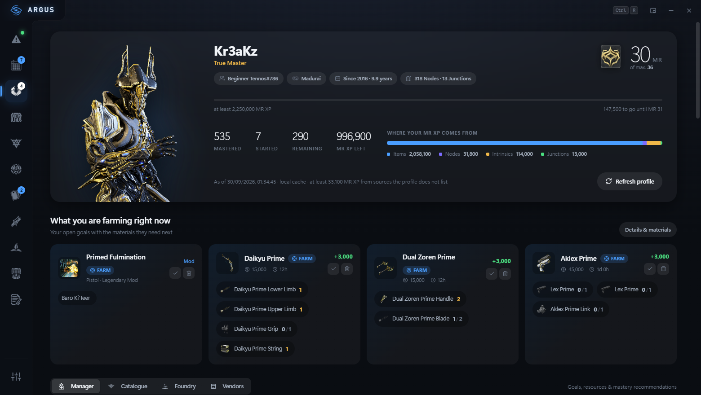
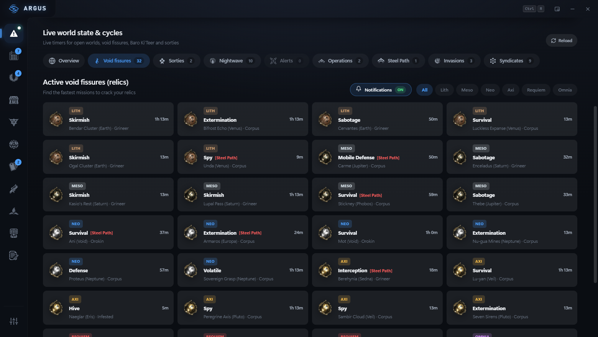
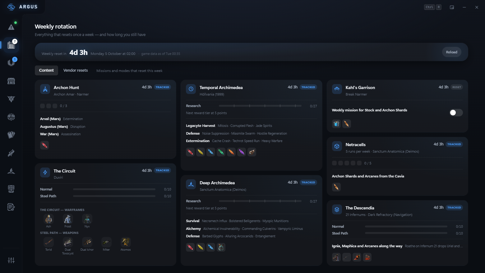
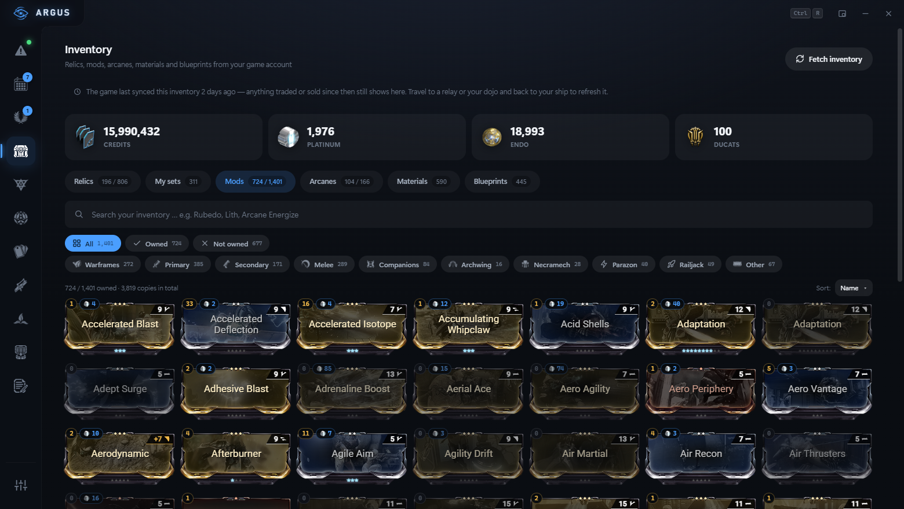
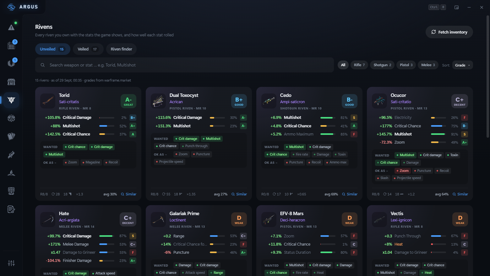
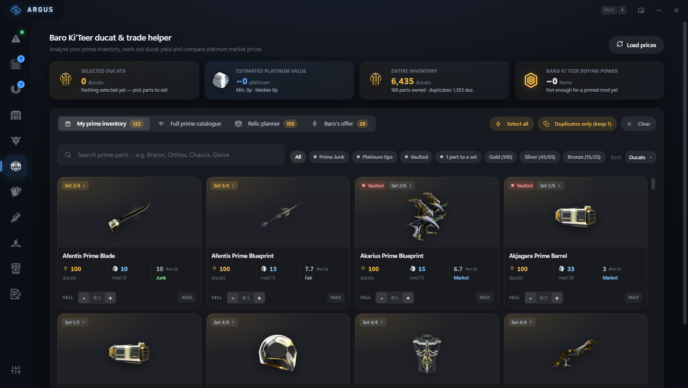
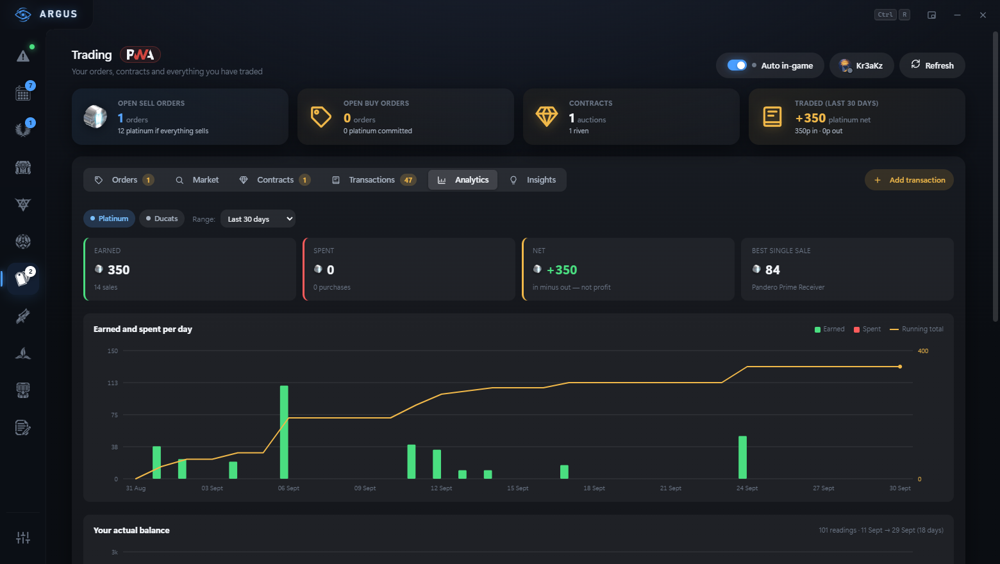
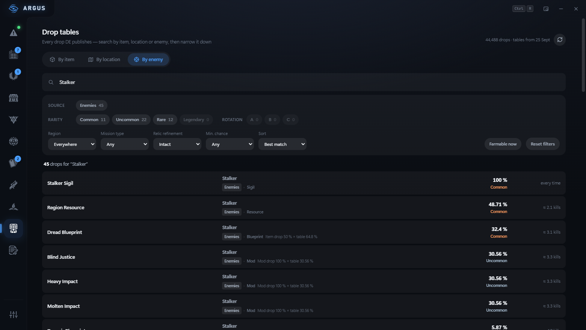
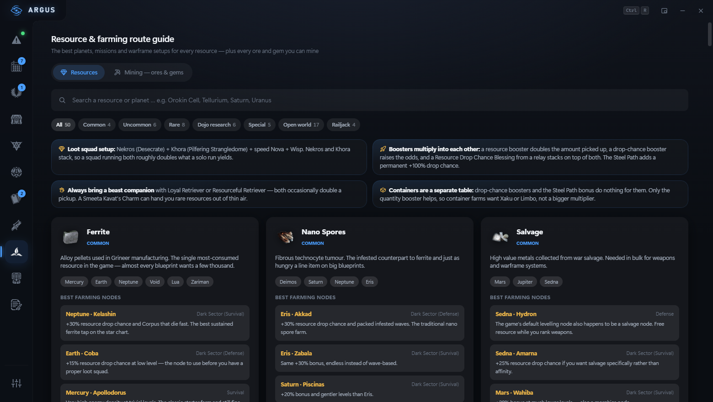
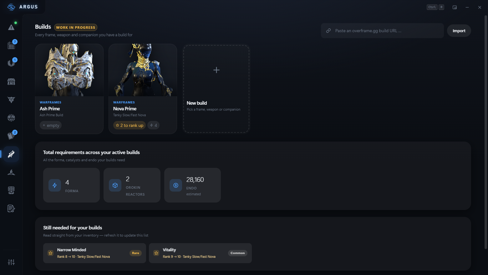

<div align="center">


# Argus

**A mastery planner and live companion for Warframe.**

*The hundred-eyed watchman of Greek myth — he never closes all his eyes at once.*

[](https://github.com/Kr3akz/Argus/releases/latest)
[](https://github.com/Kr3akz/Argus/releases)
[](LICENSE)


**[Download](https://github.com/Kr3akz/Argus/releases/latest)** ·
[What it does](#what-it-does) ·
[Is it safe?](#is-it-safe-can-i-get-banned) ·
[Getting started](#getting-started) ·
[Documentation](#documentation)

</div>

---

Argus runs next to Warframe and keeps track of what the game spreads across a dozen
menus and websites: which items you still need for mastery and what they really cost you,
what your prime parts, mods and rivens are worth, what is happening in the world right
now, and where anything drops.

While you play, it works inside the game — prices under the four cards of a relic reward
screen, your relics ranked on the selection screen, riven rolls side by side while you
cycle. It does all of that by *looking*: it never changes the game, and never logs in to
Warframe as you. Your inventory comes from the game already running on your PC,
read-only, only if you allow it, and it never leaves your machine.

**Windows only.** The panels over the game, the log reader and the inventory lookup rely
on Windows APIs. Free and open source under the GPL.



<details>
<summary><b>More screenshots</b></summary>

<br>

**Live world state — every void fissure, with its era and how long it still runs**



**Weekly rotation — everything that resets this week, ticked off from your save**



**Inventory — mods as the cards they are in game**



**Rivens — each one graded by what the market wants on that weapon**



**Ducats & Baro — melt or sell, part by part**



**Trading — the ledger, charted**



**Drop tables — what the Stalker drops, with both rolls counted**



**Farming guide — the best nodes per material**



**Builds — against what you actually own**



**Themes — nine looks, or your own**


</details>

---

## What it does

### Inside the game

- **Prices on the reward screen.** When a relic reward screen opens, Argus reads the four
  parts off the screen and puts the platinum price, the ducat value and what the whole
  set is worth under each card — in the game, not in a second window.
  → [Relic rewards](docs/relics.md)
- **The best relic for this fissure.** On the relic selection screen, a small panel ranks
  the relics you own by what one crack is worth, narrowed to the era the fissure accepts.
  → [Relic rewards](docs/relics.md)
- **Riven rolls side by side.** While you cycle a riven, your current and your new roll
  stand next to each other — every stat marked better or worse, and a grade for both —
  so you can decide before you pick. → [Rivens](docs/rivens.md)
- **The overlay window.** Open-world cycles, void fissures, your relics and goals on top
  of the running game, on a hotkey. → [Controls](docs/controls.md)
- **Notifications** for the void fissures you care about, and for whispers in game —
  if you like, only the ones copied from warframe.market, so a ping means someone wants
  to trade. → [Controls](docs/controls.md)

### Planning

- **Mastery.** Every item you have not mastered, ranked by what it actually costs you.
  Goals resolve down to the raw materials and are checked against what you own — with how
  long the build takes, whether the vault is shut on it, and which blueprints want a
  Forma before you can even start.
- **Foundry and crafting chains.** What is building and when it is done, what has been
  finished for weeks without you noticing, what the Helminth is digesting — and which
  weapons are built out of other weapons you should rank to 30 first.
  → [Foundry](docs/foundry.md)
- **Update vendors.** The shops that sell a Warframe instead of dropping it — Otak, Zorba,
  Acrithis, the shrine at Cetus — each price list lined up against what you already own.
  → [Vendors](docs/vendors.md)
- **Live world state.** Open-world cycles, void fissures, the sortie, the Archon hunt,
  Nightwave, alerts, invasions, syndicate bounties, Steel Path and Baro's countdown.
- **Weekly rotation.** Everything that resets once a week — Archon Hunt, The Circuit,
  Deep and Temporal Archimedea, Netracells, Kahl's Garrison, the Descendia and the vendor
  resets — ticked off by itself wherever your own save records it.

### What you own

- **Inventory.** Mods, arcanes and relics as the cards they are in game, with data sheets
  and rank-by-rank values. Every relic in the game, vaulted or farmable, owned or not.
  Your sets, ranked by what the part *you* hold is worth — and a warframe.market price on
  everything, at the rank you have. → [Inventory](docs/inventory.md)
- **Rivens.** Every riven with its stats exactly as the game shows them and a grade from
  S to F — taken from which stats the *pricey* rivens of that weapon carry on
  warframe.market, not from guesswork. Veiled rivens with their challenges.
  → [Rivens](docs/rivens.md)
- **Ducats & Baro.** What every prime part is worth melted against sold, what can no
  longer be farmed, a relic planner, and Baro's manifest lined up against what you
  already own. → [Ducats and Baro](docs/baro.md)

### Trading

- **warframe.market, straight from your inventory.** Orders and contracts for what you
  own, with a suggested price taken from the sellers who are in game rather than the ones
  who left days ago. A price lookup for anything, a riven finder, and ninety days of
  *completed* trades on every data sheet. → [Trading](docs/trading.md)
- **A trade ledger** in platinum *and* ducats — charted, and checked against what your
  balance actually did. **Insights** says which primes are heading for the vault next,
  and what of that is on your shelves. → [Trading](docs/trading.md)

Argus never messages anyone for you: whispers are copied to your clipboard, and you send
them yourself.

### Looking things up

- **Drop tables.** Every drop DE publishes, searchable by item, location or enemy and
  narrowed by source, rarity, rotation, planet and chance — with the real chance of enemy
  drops, the effort each one takes on average, and what changed with the last update.
  → [Drop tables](docs/droptables.md)
- **Farming & mining.** The best nodes per material, and every ore and gem of the three
  landscapes sorted by vein colour. → [Farming](docs/farming.md)
- **Builds.** Loadouts checked against what you own, or imported from Overframe — with
  the forma, catalysts and endo they add up to. → [Builds](docs/builds.md)

### Your way

- **Themes.** Nine looks to pick from — Orokin gold, Void violet, true black for OLED
  screens, a red–green safe one — or your own: six colours, corners, glow and blur,
  shared as a single line of text. The panels over the game change with it.
  → [Themes](docs/themes.md)
- **Everything where you want it.** Move and resize each panel Argus draws over the game
  on a stage shaped like your game window, pick your own hotkeys, and switch off whatever
  you do not need. → [Controls](docs/controls.md)

---

## Is it safe? Can I get banned?

The short answer is **yes, it is safe, and you will not get banned.**

The quick breakdown:

- **Argus changes nothing about the game.** No DLL injection, no hooks, no memory writes,
  and no input automation or macros.
- **No network interception.** It never sniffs or intercepts the game's encrypted network
  traffic (which would violate Warframe's EULA).
- **It never talks to Warframe's servers as if it were you.** No sign-in, no borrowed
  session, no API calls on your behalf. Your inventory is read from the memory of the game
  already running on your PC and never leaves the machine.
- **Read-only and opt-in.** Memory reading is strictly read-only (`PROCESS_VM_READ`),
  happens only when you ask for it or after a zone load, and remains completely disabled
  unless you turn it on.
- **Built-in rate limiting.** The one thing still fetched from DE — your *public*
  profile — has mandatory cooldowns to protect you from their IP login throttles.

One caveat worth stating plainly, because DE states it themselves: their policy on
third-party software has **no list of approved tools** and one rule — *use it at your own
risk*. Nothing here is approved; it is tolerated, as tools of this kind have been for
years. That is a position DE could revise at any time, and it would not be announced in
this repository.

Every mechanism, permission and endpoint is explained in detail:
**→ [Read the full security & safety breakdown](docs/security.md)**

---

## Getting started

1. **Download** `Argus-<version>-Setup.exe` from the
   [latest release](https://github.com/Kr3akz/Argus/releases/latest) and run it — no
   administrator rights needed. A **portable** `.exe` is on the same page.
2. **Windows will warn you**, because the releases are not code-signed: **More info →
   Run anyway**. Every release ships a `SHA256SUMS.txt` to check your file against.
3. **Start Warframe and log in**, then press **Allow and continue** in Argus. It finds
   your account and your inventory by itself — there is nothing to look up, copy or
   paste. No game running, or playing on console? **Enter your account ID instead**: you
   get everything except the inventory.
4. **A short tour** shows you around, pointing at each part of the window as it goes.
   **Esc** ends it; **Settings → General → Guided tour** brings it back.

Argus checks for a new version once an hour and installs it only when you click —
after checking the download against the release's checksum. Your goals, builds, notes
and themes stay where they are.

**→ [Install, updates and first run](docs/install.md)** has the details: what exactly you
agree to on the first start, what to do if your inventory does not show up, how updates
are verified, and where your data is kept.

---

## Documentation

| | |
|---|---|
| [Install, updates and first run](docs/install.md) | Download, the SmartScreen warning, the first start, updates and where your data is kept |
| [Controls, windows and settings](docs/controls.md) | The two windows, hotkeys, cursor mode, and everything under Settings |
| [Relic rewards](docs/relics.md) | The price tags on a reward screen and the relic recommendation on the selection screen |
| [Rivens](docs/rivens.md) | Grades, veiled rivens, the riven finder and the panels on the cycle screen |
| [Inventory](docs/inventory.md) | Mods, arcanes and relics — cards, data sheets and drop locations |
| [Foundry, chains, vault & subsume](docs/foundry.md) | What is building, which weapons eat other weapons, which primes are vaulted, and which frames you have subsumed |
| [Update vendors](docs/vendors.md) | The shops that sell a Warframe — their prices, what of it you own, and where the numbers come from |
| [Ducats and Baro](docs/baro.md) | Melt or sell, what can no longer be farmed, and Baro's manifest against your inventory |
| [Trading](docs/trading.md) | Orders, contracts, the local trade ledger, market history and the vault forecast |
| [Drop tables](docs/droptables.md) | Searching every drop table, the filters, what the numbers mean, and the changes after an update |
| [Resources, farming and mining](docs/farming.md) | Best nodes per material, ores and gems |
| [Builds and mods](docs/builds.md) | Loadouts, what you own, and the Overframe import |
| [Themes](docs/themes.md) | Nine presets, your own themes, sharing them, and the interface size |
| [Is this safe?](docs/security.md) | Everything Argus does to the game and your machine |
| [Known limits](docs/limits.md) | What it cannot do, and where the data stops being reliable |
| [Building from source](docs/development.md) | Build it, publish a release, find your way around |

---

## Building from source

You need Node.js 20 or newer.

```bash
git clone https://github.com/Kr3akz/Argus.git
cd Argus
npm install
npm start
```

The full picture — packaging, how a release is published, the tests and the layout of
the source tree — is in **[Building from source](docs/development.md)**.

**Note on the source:** comments and commit messages are in German. The interface and
the documentation are English.

---

## Contributing

Bug reports and ideas are welcome — open an [issue](https://github.com/Kr3akz/Argus/issues).
If you want to send code, [CONTRIBUTING.md](CONTRIBUTING.md) has the few things worth
knowing beforehand. Security problems go the way described in
[SECURITY.md](SECURITY.md), not into a public issue.

---

## Licence

[GNU General Public License v3.0 or later](LICENSE).

That means you may use, study, change and share it freely — but if you publish a
modified version, it has to stay open under the same licence. A closed-source fork of
Argus is not allowed. For a program that reads another process's memory, that matters:
every copy in circulation stays as auditable as this one.

Argus is a fan project and is **not affiliated with, endorsed by or sponsored
by Digital Extremes**. Warframe and all related assets are the property of Digital
Extremes Ltd. Game assets used in the interface belong to them and are used here under
their content usage policy.

The mod cards are set in [Roboto](https://fonts.google.com/specimen/Roboto)
(`src/renderer/assets/fonts/`), bundled under the Apache License 2.0 so the cards
read the same offline as they do in the game.
